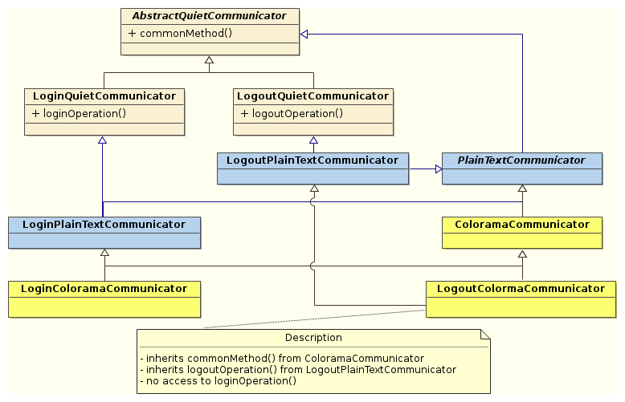

### A pluggable visualisation system for everyones needs

This directory contains all `Communicator` related classes, which encapsulate all visual feedback towards the end-user.

`Communicator` classes are instantiated via a [factory pattern](https://en.wikipedia.org/wiki/Abstract_factory_pattern), encapsulated in `fabriek.py`, and are organized into the following hierarchy:

