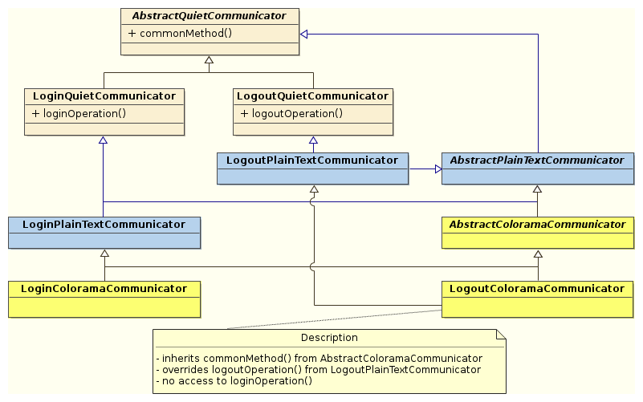

### A pluggable visualisation system for everyones needs

This directory contains all `Communicator` related classes, which encapsulate all visual feedback towards the end-user.

All `Communicator` classes extend the `QuietCommunicator`, overriding any visualisation methods of interest. They are instantiated via a [factory pattern](https://en.wikipedia.org/wiki/Abstract_factory_pattern), encapsulated in `fabriek.py`, and hierarchically organized as depicted below:

