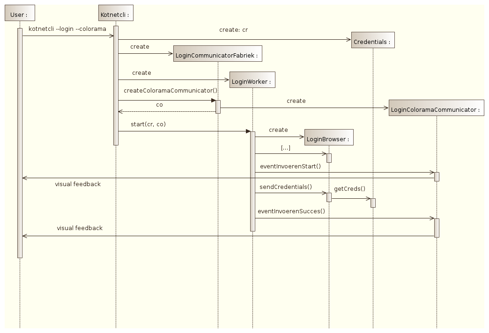

#An introduction to`kotnetcli`'s software design

*work in progress: feel free to open an issue to discuss ideas / irregularities / enhancements*

This page gives an overview of `kotnetcli`'s software design. It focuses on extensibility and elegance to help developers understand, extend and maintain the code.

## Overview

`kotnetcli` has been designed as a cohesive set of classes, each one focusing on its own explicit job: the UNIX philosophy - *do one thing and do it good*. 

The general interaction between these classes is depicted in the sequence diagram below:

This section gives an overview of all these classes, grouped into the following set of files:

#### kotnetcli.py

This file contains the `main` method and bootstraps the KotNet login procedure. As indicated by its name, this class encapsulates the *command line interface*. That is to say, it is responsible for parsing the command line arguments and interpreting them to create the correct `Worker` and `Communicator` instances below.

Note that This class actually defines the *front-end* user *input interface* for the `kotnetcli` application. User *output communication* on the other hand, is handled by the `communicator` class, as explained below.

#### worker.py

As should be clear by now, `kotnetcli`'s software design is all about dividing cohesive responsibilities over different stand-alone classes. In a way, the `worker` class hierarchy is the glue that holds it all together. Indeed, the worker class encapsulates `kotnetcli`'s internal behavior. It acts as the director, who's sole job is to call the correct method of the correct class at the correct time. In other words, it encapsulates the *sequence* of `konetcli`'s actions. It's sole job is to command other slave-classes to do the work and report progress to the `Communicator.` It's as if it steals credit for all the work, hence the name :p

`Worker` classes are organized in the hierarchy depicted below:

[ TODO figure of worker class hierarchy ]

Let's give a concrete example of directing the sequence of actions. The `LoginWorker` class delegates `kotnetcli`'s login procedure to a `KotnetLoginBrowser` class: connect to `netlogin.kuleuven.be`, kies kuleuven, input credentials, parse result. Moreover, in between these method calls and in case of failure, it notifies a `Communicator` instance of the progress.

TODO: overview of all communicator subclasses with short description + show how combining them can create the desired behavior (e.g. force login)

#### browser.py

The `Browser` class is the real workhorse of the `kotnetcli` application. This class encapsulates the fetching, parsing and sending of KotNet web pages.  It offers an abstract interface used by the `Worker` class.

`Browser` classes are organized in the following hierarchy:

[ TODO figure of browser class hierarchy ]

TODO: overview of all browser subclasses with short description

#### credentials.py

The `Credentials` class encapsulates how the username and password are stored and retrieved. To do so, it offers an abstract interface used by `kotnetcli.py`.

Currently, we store your login settings safely in your operating system's keyring. Moreover, by encapsulating this in the `Credentials` class, usernames and passwords are handled centrally and shouldn't wander around the code. Extending `kotnetcli` to use another way of storing passwords is easy too.

#### communicator.py

a pluggable visualisation system for everyones needs.

[ TODO figure of communicator class hierarchy ]
